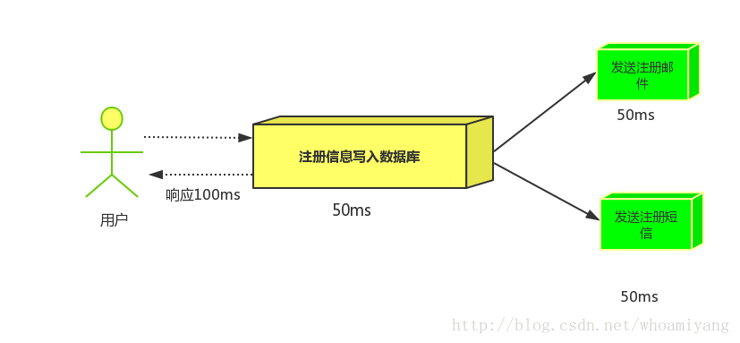
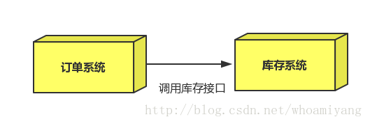
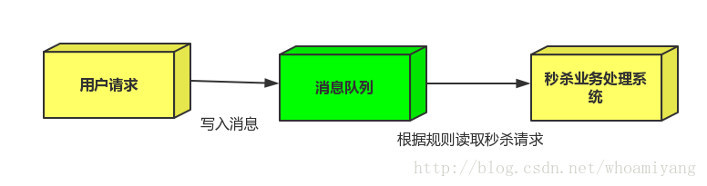
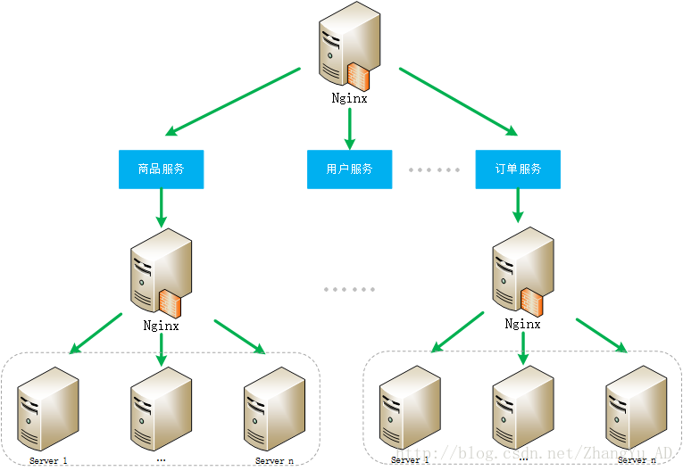
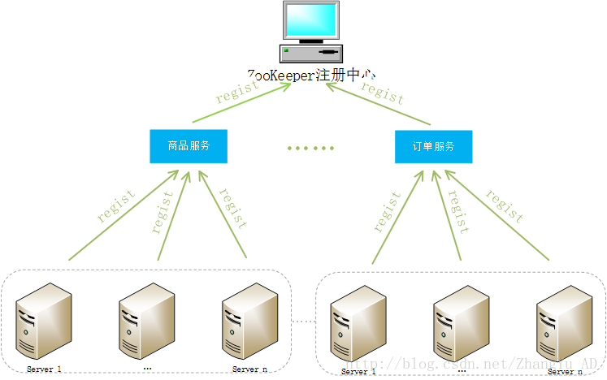

#  布式中的基本概念

## 分布式、集群、高可用

* 分布式：
  * 一个业务分拆多个子业务，部署在不同的服务器上
* 集群：
  * 同一个业务，部署在多个服务器上
* 高可用
  * 高可用HA（High Avaliability）通过设计减少系统不能提供的时间
  * 如果系统每运行100个时间单位，会有1个时间单位无法提供服务，我们说系统的可用性是99%。
* 分布式是指将不同的业务分布在不同的地方。 而集群指的是将几台服务器集中在一起，实现同一业务。
* 分布式是以缩短单个任务的执行时间来提升效率的，而集群则是通过提高单位时间内执行的任务数来提升效率。

## 负载均衡

* 概念

  * 负载均衡讲的是如何用多台计算机解决一台计算机超负荷的计算问题，主要针对WEB来做**请求分发**的。

* 常用的软件（Nginx以及Zookeeper）：

  * Ngnix是著名的反响代理服务器，也被广泛地作为负载均衡服务器

  * Zookeeper是分布式协调服务框架，有时也被用来做负载均衡

    ​

## 消息队列

* 概念

  * 消息队列（MQ）从字面上看，就是队列，FIFO，只不过队列中存放的内容是message，其主要用途是**不同进程/线程之间的通信**。

* 为什么要产生消息队列？

  * **不同进程之间消息传递时，两个进程之间耦合程度过高**，改动一个进程，引发修改另一个进程，为了隔离这两个进程，在两进程之间抽离出一层（一个模块），所有两个进程之间传递的消息必须通过消息队列来传递，单独修改一个进程，不会影响另外一个。
  * 不同进程（process）之间传递消息时，为了实现标准化，将消息的格式规范化了，并且，某一个进程接受的消息太多，一下子无法处理完，并且也有先后顺序，必须对收到的消息进行排队，因此诞生了事实上的`消息队列`；

* 为什么要使用消息队列？

  * 系统解耦：项目开始时，无法确定最终需求，不同进程间，添加一层，实现解耦，方便今后的扩展。
  * 消息缓存：系统中，不同进程处理消息速度不同，MQ，可以实现不同Process之间的缓冲，即，写入MQ的速度可以尽可能地快，而处理消息的速度可以适当调整（或快、或慢）。
  * 提升系统可靠性：
  * 提升系统可扩展性：

* 常用软件（框架）：**kafka、RabbitMQ、ZeroMq、ActiveMq**

  * Kafka设计的初衷就是处理日志的，可以看做是一个日志系统，针对性很强，所以它并没有具备一个成熟MQ应该具备的特性。

* **RabbitMQ,ActiveMq,ZeroMq比较**

  | 比较类型                        | **RabbitMQ** | **ActiveMq** | **ZeroMq** |
  | --------------------------- | ------------ | ------------ | ---------- |
  | TPS(系统吞吐量)                  | 次之           | 最差           | 最好         |
  | 消息持久化                       | 支持           | 支持           | 不支持        |
  | 高并发                         | 最高           |              |            |
  | 技术点(可靠性、灵活路由、集群、事务高可用的队列等等) | 最好           | 次之           | 最差         |

* RabbitMQ与Kafka比较

  | 比较类型        | RabbitMq | kafka |
  | ----------- | -------- | ----- |
  | 成熟、稳定性      | 最好       | 次之    |
  | 性能（吞吐量、TPS） | 次之       | 最好    |
  | 日志处理        | 次之       | 最好    |

* **适用场景**

  - 异步处理

    - 场景说明：用户注册需要发送邮件、短信，传统的做法如图所示：

      

    - 在消息队列中，把发送邮件、短信这些不是必须的业务逻辑异步处理，如下图所示：

      

  - 应用解耦

    - 场景说明：双11购物，用户下单后，订单系统需要通知库存系统，传统的做法是订单系统调用库存系统的借口：

      

    - 引入消息队列，可以控制活动的人数，当超过一定的阀值得订单直接丢弃，可以缓解段时间内的高流量压垮应用，如下图：

      

      - 用户的请求服务器收到了之后，首先写入消息队列中，如果加入的消息队列长度超过最大值，则直接抛弃用户请求或跳转到错误页面。

## 不同软件（框架）的介绍以及优势

### Nginx

* Nginx的负载均衡配置

  * 把多个web service配置到nginx中，用户访问Nginx时，就会自动分配到某个web server。
  * 当网站规模变大，通常会进行服务拆分，各个服务独立部署，通过远程调用方式协同工作。
  * 为了保证稳定性，每个服务不会只使用一台服务器，也会作为一个集群存在，那么子集群也可以使用Nginx负载均衡。

* 其对应的工作方式如下所示：

  

* 使用场景

  * 使用Nginx，随着系统的演进，服务的数量会增加、每个服务集群中的服务器数量会增加，这时就会出现小麻烦
    * 配置维护的成本变高，因为节点太多 
    * 单点故障的风险增加了，因为热点服务的访问量很高，如果这个服务集群内的负载均衡服务出现问题，这个服务将失效

### Zookeeper

* Zookeeper的负载均衡模式

  * Zookeeper作为一个服务的注册中心，每个服务在其注册中心登记，每台服务器都知道自己属于哪个服务，在服务器启动时，自己向所属服务进行登记。
  * 服务的调用者到注册中心里面查找：能提供所需服务的服务列表，然后自己根据负载均衡算法，从中选取一台服务器连接。
  * 调用者取到服务列表后，就可以缓存到自己内部，下次就不用在取，当服务器列表发生变化，如某台服务器宕机下线，或者新添加了服务器，Zookeeper就会自动通知调用者重新获取服务列表。

* Zookeeper的工作模式

  

* 使用场景

  * ZooKeeper作为服务的注册和变更通知中心，解决了Nginx负载均衡方案带来的问题。 
  * ZooKeeper并没有内置负载均衡策略，需要调用者自己实现，这个方案只是利用了ZooKeeper的树形数据结构、watcher机制等特性。

-----

### kafka

* 概念

  * Kafka是由LinkedIn开发的一个分布式基于发布/订阅的消息系统，使用Scala编写，它以可水平扩展和高吞吐率而被广泛使用。

* **产生背景**

  *  Kafka是一个**消息系统**，用作LinkedIn的活动流（Activity Stream）和运营数据处理管道（Pipeline）的基础。活动流数据是几乎所有站点在对其网站使用情况做报表时都要用到的数据中最常规的部分。**活动数据包**括页面访问量（Page View）、被查看内容方面的信息以及搜索情况等内容。这种数据通常的处理方式是**先把各种活动以日志的形式写入某种文件**，然后周期性地对这些文件进行统计分析。**运营数据**指的是服务器的性能数据（CPU、IO使用率、请求时间、服务日志等等数据)。运营数据的统计方法种类繁多。

* 基本架构图

  

* 适用场景

  * Messaging
    *  对于一些**常规**的消息系统,kafka是个不错的选择;partitons/replication和容错,可以使kafka具有良好的扩展性和性能优势.不过到目前为止,我们应该很清楚认识到**,kafka并没有提供JMS中的"事务性""消息传输担保(消息确认机制)""消息分组"等企业级特性**;kafka只能使用作为"常规"的消息系统,在一定程度上,尚未确保消息的发送与接收绝对可靠(比如,消息重发,消息发送丢失等)
  * Website activity tracking
    * kafka可以作为"网站活性跟踪"的最佳工具;可以将网页/用户操作等信息发送到kafka中.并实时监控,或者离线统计分析等
  * Metrics
    *  Kafka通常被用于可操作的监控数据。这包括从分布式应用程序来的聚合统计用来生产集中的运营数据提要。
  * Log Aggregation
    * kafka的特性决定它非常适合作为"**日志收集中心**";application可以将操作日志"批量""异步"的发送到kafka集群中,而不是保存在本地或者DB中;kafka可以批量提交消息/压缩消息等,这对producer端而言,几乎感觉不到性能的开支.此时consumer端可以使hadoop等其他系统化的存储和分析系统

### RabbitMQ

* 概念
  * RabbitMQ是一个开源的AMQP(高级消息队列协议)实现，服务器端用Erlang语言编写，支持多种客户端。
  * RabbitMQ 是一个消息代理，主要接受、存储和转发消息。你可以把它想象成邮局：当你将一个包裹送到邮局，邮局会暂存并最终将邮件由邮递员送到接件人手上，RabbitMQ就好比一个邮局、邮箱和邮递员。

###  ZeroMq

* 概念
  * ZeroMQ是一种基于消息队列的多线程网络库，其对套接字类型、连接处理、帧、甚至路由的底层细节进行抽象，提供跨越多种传输协议的套接字。ZeroMQ是网络通信中新的一层，介于应用层和传输层之间（按照TCP/IP划分），其是一个可伸缩层，可并行运行，分散在分布式系统间。
* 应用场景
  * 应用ZeroMQ的Push-Pull模型实现联众游戏服务器的“热插拔”、负载均衡和消息派发。

### ActiveMq

* 概念
  * Apache中流行的，能力强劲的开源消息总线。是一个完全支持JMS1.1和J2EE 1.4规范的 JMS Provider实现。

--------------