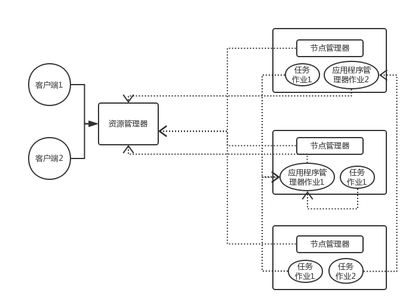

### Hadoop系统组成

#### Hadoop1.x的系统组成

* **NameNode**(名称节点)

  > 维护着存储在HDFS上所有文件的元数据信息。这些元数据信息包括组成文件的数据块信息，及这些数据块在数据借点上的位置。

* **Secondary NameNode**(辅助名称节点):

  > 辅助NameNode更好的完成工作，并不会成为NameNode。主要负责备份镜像，以及镜像和日志的合并

* **DataNode**（数据节点）:

  > 把真正的数据块存放在本地硬盘上，这些数据块组成了HDFS文件系统中的文件

* **JobTracker**（作业跟踪器）：

  > 这是Hadoop中主要的组件之一，负责一个任务的执行过程。具体的功能包括：
  >
  > 1. 调度各个子任务(Mapper任务和Reducer任务各自的子任务)到各自的计算节点运行
  > 2. 时刻监控任务运行和计算节点的健康状况
  > 3. 对失败的子任务重新调度执行

* **TaskTracker**（任务跟踪器）：

  > 运行在各个数据节点上，用来启动和管理各个Map/Reduce任务。与作业跟踪器进行通信。

* Hadoop1.x 集群的两种类型节点：主节点(master nodes)和从节点(slave nodes)。

  * 主节点负责执行如下几个守护进程：

    > 1. 名称节点进程
    > 2. 辅助节点进程
    > 3. 作业跟踪器进程

  * 从节点分布在整个集群上并执行如下几个守护进程：

    > 1. 数据节点进程
    > 2. 任务跟踪器进程

##### Hadoop分布式文件系统（HDFS）

* HDFS文件系统由以下几个守护进程来协调运行并提供服务：

  1. 名称节点进程

  2. 辅助节点进程

  3. 数据节点进程

     > HDFS系统也是主从架构。运行名称节点进程的服务器为主节点，运行数据节点进程的服务器为从节点.

  * Hadoop文件的本质是块存储

    > 在Hadoop系统中，每个文件分割为多个数据块。数据块大小默认为M。如果一个文件大小不是一个文件块大小的整数倍，最后一个文件块也会按照大小为文件块大小进行存储。
    >
    > 在Hadoop系统中，备份数量默认为3。Hadoop系统也具备机架感知功能，会将文件的一个数据块存放在本地机架上的数据节点上。第二个备份文件块会被存放在远程的数据节点上。第三个备份会被存放在第二个备份的同一个机架的另外一个数据节点上。

  *  文件元数据和名称节点

    > HDFS系统提供一个统一的文件系统命名空间，用户就像使用一个文件系统一样来存取集群节点上的数据。HDFS把存储在目录中的文件按照一定的层级展示出来(目录可以嵌套)。所有文件和目录的元数据信息都由名称节点来负责管理

    > 名称节点管理所有的文件操作，包括文件/目录打开、关闭、重命名、移动等等。数据节点就负责存储实际的文件数据。

    > 名称节点存储的一些元数据包括：
    >
    > 1. 文件/目录名称以及对其父目录的位置
    > 2. 文件和目录的所有权以及权限
    > 3. 各个数据块的文件名。
    >
    > NameNode维护的是HDFS上的文件由哪些数据块(数据节点上每隔数据块的文件名)组成。

    > NameNode上存放的元数据的文件为fsimage。在Hadoop系统运行期间对元数据的修改的操作都会保存在内存中并且持久化到另外一个edits的文件中。Secondary NameNode会定期吧edits文件中的信息合并到fsimage中。

    > 数据节点守护进程会周期性的发送心跳给NameNode。这使得名称节点可以感知所有数据节点的健康状况，从而客户端的请求不会被发送到故障节点。

* HDFS系统写文件的机制

  > 客户端把一个文件写到HDFS文件系统中的几个步骤如下所示：

  1.  客户端在联系NameNode之前，会把文件数据流读到客户端的本地文件系统中的一个临时文件中。
  2. 当文件数据的大小达到一个数据块大小的时候，客户端就会联系NameNode。
  3. NameNode会在HDFS文件系统的层级结构中构建一个文件，然后把数据块的标识符和DataNode上的位置发送给客户端。这个数据节点数据块信息列表里面还包括了其备份节点数据块信息列表。
  4. 客户端收到数据节点数据块信息列表之后会根据数据块信息把本地临时文件中的数据刷新到集群中的数据块中(只写入到第一个数据节点中)。
  5. 当文件被关闭时，NameNode会执行一个提交的操作，从而使文件在集群中处于可见状态。(如果提交操作完成之前NameNode挂掉了，这个文件就丢失了)

* HDFS写文件机制

  > HDFS读取文件的详细步骤如下所示：

  1. 客户端访问NameNode，NameNode返回组成文件的数据块列表以及文件的位置(包括备份的数据块位置)
  2. 客户端会直接访问数据节点以获取数据块中的数据。如果此时其访问的数据节点出现故障，就会访问存放备份数据块的节点。
  3. 读取数据块的时候会计算数据块的校验和，并将该校验和写入文件时的校验和做比较，如果校验失败，则从其他数据节点获取备份数据块。

* HDFS系统删除文件机制

  > HDFS系统删除一个文件，具体的步骤如下所示：

  1. NameNode仅仅重命名干了文件路径，使其移动到了`/trash`目录。这个操作过程链接到重命名文件路径的元数据的更新操作。操作的速度快。在`/trash`目录中，问价会保存一定时间。在这段时间之内，把删除的文件可以从`/trash`中迅速恢复。
  2. 当`/trash`目录中的文件超过了保存的时间，NameNode就会将该文件从HDFS的命名空间中删除。
  3. 删除文件使得该文件的相关数据块被释放。

* **Secondary NameNode**

  1. Secondary NameNode的作用就是周期性的把edits文件中的内容与fsimage文件中的内容进行合并。具体的执行殊勋如下所示：

     1. Secondary NameNode会请求NameNode来结转(roll over)edits文件确保新的更新保存到一个新的文件(叫做edits.new)
     2. Secondary NameNode向NameNode请求获取fsimage文件和edits文件。
     3. Secondary NameNode接收到把edits文件和fsimage文件合并，形成一个新的fsimage文件。
     4. NameNode从Secondary NameNode接收新的fsimage文件，并且替代旧的fsimage文件，同时将edits文件中的内容替换成步骤1中创建的edit.new文件的内容。
     5. 更新fstime文件来记录发生的检查点操作。

     | 文件名  | 描述                                                       |
     | ------- | ---------------------------------------------------------- |
     | fsimage | 保存最近一次检查点的HDFS系统元数据的持久化状态信息         |
     | edits   | 保存最近一次检查点之后到现在的HDFS系统元数据的状态变化信息 |
     | fstime  | 保存了最近一次检查点的时间戳                               |

* TaskTracker(任务跟踪器)

  1. 任务跟踪器守护进程在集群中每台计算节点中运行，接收诸如Map、Reduce和Shuffle这些操作的任务请求。任务跟踪器接收到一个请求（来自作业跟踪器）之后，就会启动一个任务，任务跟踪器会为这个任务初始化一个新的JVM。任务跟踪器负责向作业跟踪器发送心跳消息。除了向作业跟踪器反馈任务跟踪器的运行状况之外，心跳信息还包括了任务跟踪器当前可用的槽位数。

* JobTracker(作业跟踪器)

  1. 作业跟踪器守护进程负责启动和监控MapReduce作业。当一个客户端想Hadoop系统提交一个作业，具体步骤如下所示：

     1. 作业跟踪器接收到作业请求

     2. 大多数MapReduce作业都需要一个或者多个输入文件目录。任务跟踪器向名称节点发出请求，获得一个数据节点的列表，这个列表上的数据节点中存储了组成输入文件的数据块。

     3. 作业跟踪器为作业的执行做准备，包括设置需要执行Map任务和Reduce任务的数量，作业跟踪器会将这些任务都调度到离数据块最近的位置上。

     4. 作业跟踪器把任务提交到每隔任务跟踪器节点去执行。任务跟踪器监控任务执行的情况。任务跟踪器以预先设定好的时间见个发送心跳信息到作业跟踪器。如果作业跟踪器在预先设定好的时间间隔之后没有收到任务跟踪器发送过来的心跳信息，那么就认为该任务跟踪器节点出现故障，就会被调度到另外一个节点去运行。

     5. 一旦所有的任务都执行完毕，作业跟踪器就会更新作业状态为成功。如果任务失败达到一定的数量，作业跟踪器就会宣布失败。

     6. 客户端会轮询作业跟踪器及时地获得作业运行状态。

        > 因此，作业跟踪器的故障会导致Hadoop系统的单点故障，如果挂掉了，集群上的所有的任务都将无法正确运行。

### Hadoop2.X

* 在Hadoop2.x 中升级后的版本被称之为MR2或者YARN。

* 在Hadoop1.x中的作业调度器承担两个功能：资源管理、作业调度/作业监控

* YARN把这两个功能分为两个守护进程来承担。使得系统中有一个全局的资源管理器以及每个程序有一个应用程序管理器

* YARN系统由一下几个部分组成

  1. Resource Manager
  2. Node Manager
  3. Application Master
  4. Sheduler
  5. Container

* 一部分CPU内核和一部分内存构成一个容器。一个应用程序运行在一组容器中。应用程序管理器的一个实例会向资源管理器请求获取资源。调度器会通过每隔节点的Node Manager来分配资源(容器)。Node Manger会想资源管理器汇报每隔容器的使用情况。

* 资源管理器和每隔节点的Node Manager构成了新MapReduce框架的管理系统。资源管理器负责系统资源的分配。每种应用程序都有一个应用程序管理器（如：MapReduce是一种应用程序，每隔MapReduce作业就是MapReduce类型程序的一个实例，就像类与对象的关系）。针对同一应用程序类型的所有应用程序，一个应用程序管理器被初始化。应用程序管理器实例向全局资源管理器协商获得容器来运行作业。资源管理器利用调度器与每隔节点的Node Manager沟通分配资源。YARN全局架构图如下所示：

  

* ​

