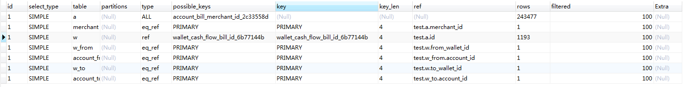

## 数据库优化

### 1. 关系型数据库的优化

#### 1.1. 优化工具介绍

* 常用的优化工具
  * 常用的数据库优化工具有EXPLAIN等等

#### 1.2. EXPLAIN介绍

1. 如何使用？

   * 使用的方式为： `explain + 查询的sql语句`

   ```sql
   EXPLAIN SELECT 
   	IF (a. STATUS = 1,(w.remark),(a.remark)) remark,a.type, 
   	a.created,merchant.nickname AS merchant_nickname, 
   	account_from.username AS merchant_name,FROM account_bill a
   LEFT JOIN wallet_cash_flow w ON w.bill_id = a.id
   LEFT JOIN wallet w_from ON (w_from.id = w.from_wallet_id)
   LEFT JOIN wallet w_to ON (w_to.id = w.to_wallet_id)
   INNER JOIN account merchant ON merchant.id = a.merchant_id
   LEFT JOIN account account_from ON account_from.id = w_from.account_id
   LEFT JOIN account account_to ON account_to.id = w_to.account_id
   ```

2.  返回的结果

   * 将会返回对应表的分析，如下图所示：

     

3.  返回的结果分析

   * id：select识别符。这是select查询的序列号（也就是sql语句执行的顺序）
   * select_type： select类型，它有以下几种值
     * simple：表示简单的select，没有union和子查询
     * primary：最外面的select在有子查询的语句中，最外面的查询就是primary
     * union：union语句第二个或者说是最后一个
     * dependent union：union中的第二个或后面的SELECT语句，取决于外面的查询
     * union result：union的结果


   * table：显示这一行的数据是关于哪一张表的
   * type：连接类型，有多个参数（重要）
     * system：表仅有一行，这是const类型的特列
     * const：表最多有一个匹配行，const用于比较primary key或者unique索引。因为只匹配一行数据，所以查询很快，也是最优的。
     * eq_ref ：对于每个来自于前面的表的行组合，从该表中读取一行。这可能是最好的联接类型，除了const类型。它用在一个索引的所有部分被联接使用并且索引是UNIQUE或PRIMARY KEY
     * ref：对于每个来自前面的表的组合，所有有匹配的值的行将从这张表中读取。如果使用的键仅仅匹配少量行，该连接类型是不错的。
     * ref_or_null：该连接类型如同ref，但是添加了MySQL可以专门搜索包含NULL值得行，在解决子查询中经常使用到。
     * 以上五种情况都是理想的情况
     * index_merge：该连接类型表示使用了索引合并优化方法。在这种情况下，key列包含了使用索引的清单，key_len包含了使用索引的最长的关键元素。
     * unique_subquery 
     *  index_subquery
     * range 给定范围内的检索，使用一个索引来检查行
     * index     该联接类型与ALL相同，除了只有索引树被扫描。这通常比ALL快，因为索引文件通常比数据文件小。
     *  ALL  对于每个来自于先前的表的行组合，进行完整的表扫描。
   * **possible_keys**：提示使用哪个索引会在该表中找到行
   * **key**： MYSQL使用的索引，简单且重要
   * **key_len**： MYSQL使用的索引长度
   * **ref  ：**ref列显示使用哪个列或常数与key一起从表中选择行。
   * **rows** ：显示MYSQL执行查询的行数，简单且重要，数值越大越不好，说明没有用好索引
   * **Extra** ：该列包含MySQL解决查询的详细信息
     * Distinct     MySQL发现第1个匹配行后，停止为当前的行组合搜索更多的行
     *  Not exists  
     * range checked for each record：没有找到合适的索引
     * using filesort：MySQL需要额外的一次传递，以找出如何按排序顺序检索行。通过根据联接类型浏览所有行并为所有匹配WHERE子句的行保存排序关键字和行的指针来完成排序。然后关键字被排序，并按排序顺序检索行。
     * using index：只使用索引树中的信息而不需要进一步搜索读取实际的行来检索表中的信息。这个比较容易理解，就是说明是否使用了索引
     *  using temporary：为了解决查询，MySQL需要创建一个临时表来容纳结果。典型情况如查询包含可以按不同情况列出列的GROUP BY和ORDER BY子句时。出现using temporary就说明语句需要优化了

### 2.非关系型数据库优化 


