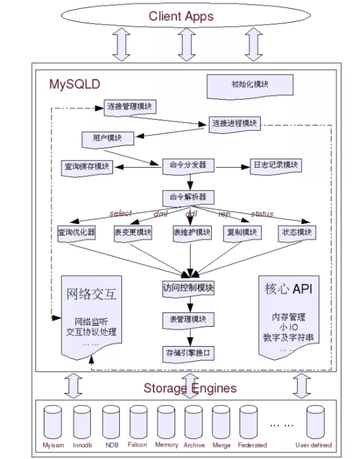
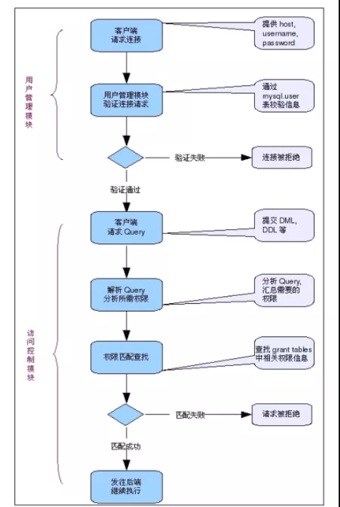

## 1.mysql适用场景？

* web网站系统
* 日志记录系统
* 数据仓库系统
* 嵌入式系统

## 2.日志文件

### 2.1 错误日志：Error Log

* 错误日志记录Mysql Server运行过程中的较为严重的警告和错误信息，以及Mysql Server每次启动和关闭的详细信息。一般系统是默认关闭的，如需开启，在启动的时候开启-log-error选项。错误日志存放在数据目录下。

### 2.2 二进制日志

* 当开启二进制日志的时候，Mysql会将所有修改数据库的query以二进制形式记录到日志文件中。其中还包含每一条query所执行的时间，消耗的资源，以及相关事务信息，因此二进制日志是事务安全的。

### 2.3 查询日志

* 查询日志记录Mysql中所有的query，开启之后会对性能有比较大的影响。

### 2.4 慢查询日志

* 慢查询日志中记录的是执行时间较长的query，也就是我们常说的slow query。默认的文件名为hostname-slow.log

### 2.5 Innodb的在线redo日志

## 3. 数据文件

* 在mysql中每一个数据库都会定义好（或者默认）的数据目录下存在一个数据库名字相同的文件夹，用来存放该数据库中的各种表数据文件。不同的Mysql存储引擎有个字不同的数据库文件，存放位置也有区别。

### 3.1 “.frm”文件

* 与表相关的元数据（meta）信息都存放在".frm"文件中，包括表结构的定义信息等。不论是什么存储引擎，每一个表都会有这个文件。并且存储在数据库文件夹下面。

### 3.2 ".MYD"文件

* ".MYD"文件是MyISAM存储引擎专用，存放MyISAM表的数据。每一个MyISAM表都会有一个".MYD"文件与之对应，同样存放于数据库文件夹下面。

### 3.3 “.MYI”文件

* “.MYI”文件也属于MyISAM存储引擎的，主要存放MyISAM表的索引相关信息。同样，每一个MyISAM文件对应一个“.MYI”文件。

### 3.4 “.ibd”文件和ibdata文件

* 这两个文件都是存放Innodb数据的文件，之所以有两种文件存放的数据（包含索引），是因为Innodb的数据存储方式能够通过配置来决定是使用共享表空间存储数据还是独享表空间存放存储数据。独享表空间存储使用“.ibd”文件来存储，且每一个表对应一个".ibd"文件。如果是共享表空间，则会使用ibdata文件存储，所有的表共同使用一个或者多个。

## 4 逻辑模块组成

* MySQL可以看成是两层架构，第一层我么通常叫做SQL Layer，在MySQL数据库系统处理底层数据之前的所有工作都是有这一层完成的，包括权限的哦安段，sql解析，执行计划优化，query cache的处理等等；第二层就是存储引擎层，我们通常叫做Storage Engine Layer，也就是底层数据存取操作实现部分，由多种存储引擎共同组成。

* 初始化模块

  * 初始化模块就是在MySQL Server启动的时候，对整个系统做各种各样的初始化操作，比如各种buffer，cache结构的初始化以及内存空间的申请，各种系统变量的初始化设定，各种存储引擎的初始化设置等等。

* 核心API

  * 核心API模块主要是为了提供一些需要非常高效的底层操作功能的优化实现，包括各种底层数据结构的实现，特殊算法的实现，字符串处理，数字处理等，小文件I/O，格式化输出，以及重要的内存管理部分。核心API模块的所有源代码都集中在mysys和strings文件夹下。

* 网络交互模块

  * 底层网络交互模块抽象出底层网络交互所使用的接口api，实现底层网络数据的接收与发送，以方便其他各个模块调用，以及对这一部分的维护。所有源码都在vio文件夹下。

* Client&Server交互协议模块

  * 任何C/S结构的软件系统都会有自己独有的信息交互协议。Mysql的Client&Server交互协议模块部分实现了客户端与Mysql交互过程中的所有的协议。

* 用户模块

  * 用户模块所实现的功能主要包括用户的登陆连接权限控制和用户的授权管理。

* 访问控制模块

  * 根据用户模块中各个用户的授权信息，以及数据库自身特有的各种约束，来控制用户对数据的访问。

* 连接管理、连接线程和线程管理

  * 连接管理模块负责监听对MySQL Server的各种请求，接收连接请求，转发所有连接请求到线程管理模块。每一个连接上MySQL Server的客户端请求都会被分配（创建）一个连接线程为其单独服务。
  * 连接线程负责MySQL Server与客户端的通信，接受客户端的命令请求，传递Server端的结果信息等。
  * 线程管理模块负责维护这些连接线程。

* Query解析和转发模块

* Query Cache模块

* Query优化器模块

* 表变更管理模块

* 表维护模块

* 系统状态管理模块

* 表管理模块

* 日志记录模块

* 复制模块

* 存储引擎接口模块

* 各个模块之间的关系如下所示：

  

* 执行流程

  

