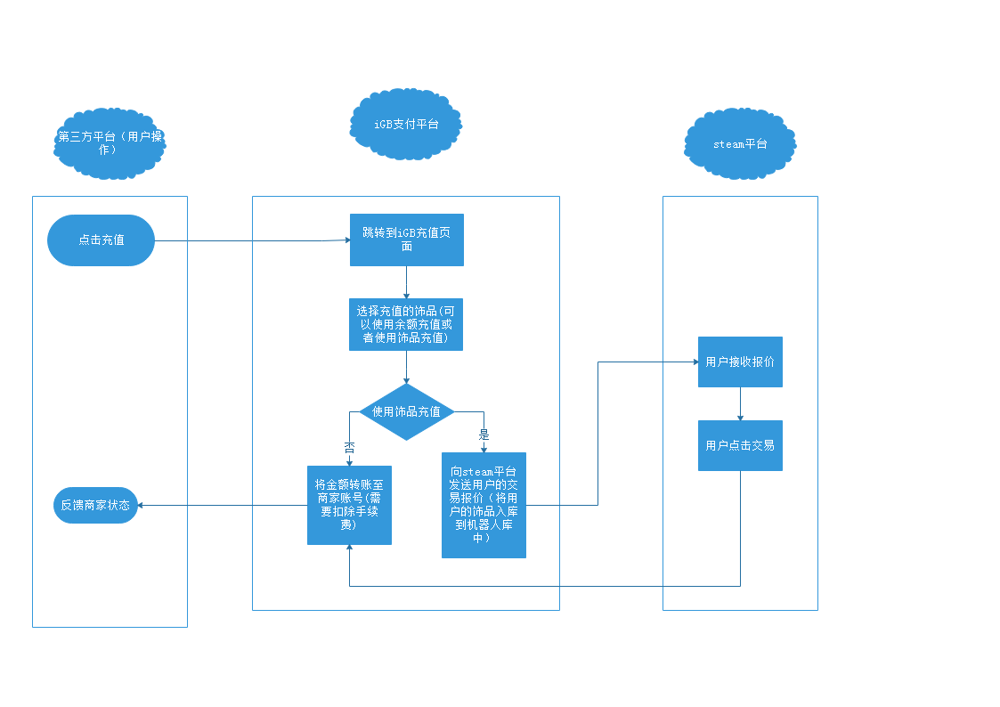
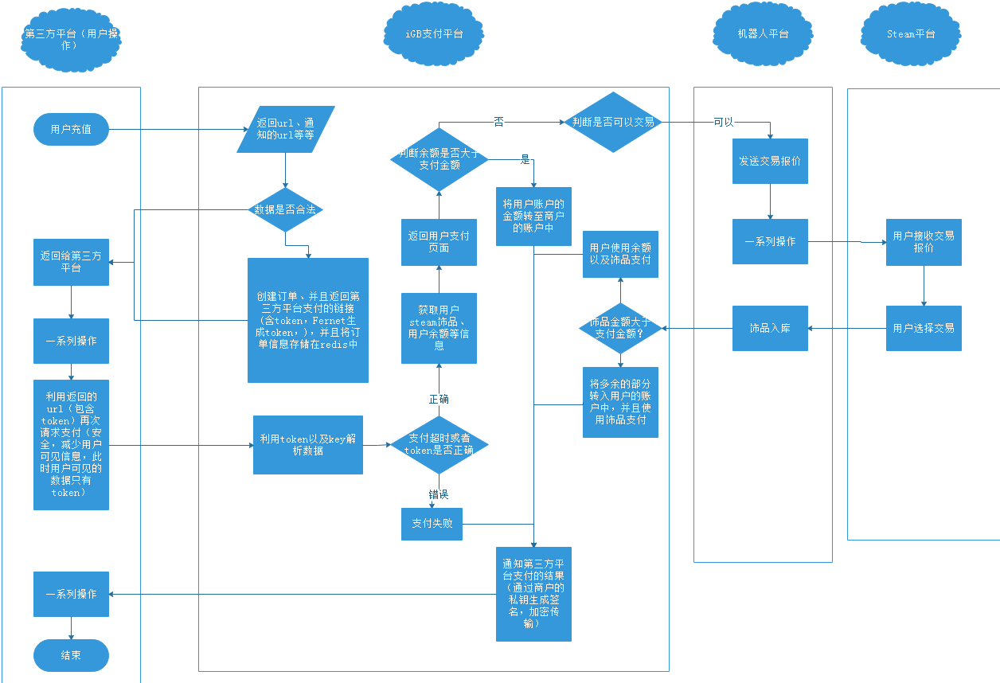

##  项目

### 1. SoftIsland运维监控平台 

* 功能点包括：资产管理、应用管理、任务编排、监控平台、用户管理、以及系统的配置。

* 资产管理：主机管理、机房管理、属组管理、资产导出
  * 主机管理：包括对应的主机名、IP地址、主机组、资产编号、设备类型、设备状态、操作系统、设备对应的厂商、CPU型号、CPU数量、内存大小、硬盘信息、所在机房、位置信息等
    * 具体的操作：添加设备、删除设备、编辑设备以及进入对应的webSSH。
  * 机房管理：机房名称、机房地址、机房电话、客户经理、移动电话、机柜信息、IP范围、接入的管带等信息
    * 具体操作：添加机房、删除机房、以及修改机房
  * 属组管理
    * 添加组、删除组以及修改组
    * 修改组：移除组中的设备，添加设备到该组中

* 应用管理：项目负责人管理、项目管理（目前阶段主要用于记录对应有哪些应用，方便后期维护，后期将会监控应用）
  * 项目负责人管理：主要记录负责人的联系方式（增删改查）
  * 项目管理：项目相关的信息的增删改查

* 任务编排：
  * 任务的增删改查
  * 任务结果的查看

* 监控平台
  * 查看对应的设备状态
  * 查看设备CPU、磁盘、网络IO、内存使用率、以及对应的进程数据等等。
  * 报警，当CPU连续一直大于90%或者内存使用率一直偏高的时候，会向工作人员发送短信，并且可以查看对应偏高的进程

* 用户管理：
  * 用户信息的增删改查

* 系统配置：
  * 存储的对应的数据库、日志等配置信息的设置

* 使用sentry、python2.7、redis、mysql、django1.11、layui

  ​

*  本系统是公司为了用于方便自己产品的部署而开发的，系统包括资产管理、应用管理、任务编排、监控平台、用户管理以及系统配置。系统使用的是Python2.7以及Django Web框架，缓存采用的是redis数据库，数据存储采用的是mysql、前端的页面的展示采用的是layui框架。

###  2. iGB支付项目

* 用来做什么的？

  * 类似于淘宝和支付宝的关系，只不过IGB支付用于在购买饰品的时候可以用iGB来支付，以及将steam中的饰品变现
  * 做这个项目的目的在于将库存中的僵死饰品变活，可以使用不喜欢的饰品购买自己心仪的饰品，也减少公司饰品库存过多的风险。

*  功能说明

  *  用户：支付功能、饰品充值、交易详情、饰品交易详情、公众号绑定、用户代理
  *  商户：个人信息、订单流水、提现管理
  *  系统后台：系统设置、商户管理（账号管理、提现管理）、用户管理（用户注册管理、反馈管理、商务合作管理）、库存管理（机器人管理、饰品库存管理、入库日志、商品管理）、定价管理（价格计算策略管理、商品定价管理）、出库管理（出库单查看、出库）、账单管理（账单流水、账单充值流水、商城充值流水）、系统统计（用户登录统计、用户日报统计、充值信息统计、交易统计、个人推荐统计）、首页Banner管理

*  负责的模块

  *  用户模块：用户推荐明细
  *  商户模块：订单流水以及提现管理
  *  系统后台：商户管理、用户管理、价格计算策略、账单管理、系统统计、Banner管理

*  功能流程图：

  *  支付的流程图如下所示：

    

  *   支付的详细的流程如下所示：

     

  ​

*  使用sentry、python2.7、redis、mysql、django1.11、vue、layui

### 3. AboxOne娱乐开箱站

*  用来做什么？
  * 用户通过金额来抽取饰品
*  功能：
  * 用户：充值、饰品开箱、代理用户、交易明细、代金券、充值返利
  * 系统后台： 开箱管理、用户管理、饰品入库管理、代理商管理、公告管理、开箱管理
*  负责的模块：
  * 用户： 充值（代金券）、Banner管理、交易明细、代理商管理
  * 系统后台：代理商用户管理（用户通过代理商链接进入系统并且充值之后，代理商就会获得奖励金）、充值返利管理（充值金额在10~50美元赠送金额为3%......）、代金券管理（产生代金券）、Banner管理（首页显示）
*  使用sentry、python2.7、redis、mysql、django1.11、vue、layui

###  4. 项目中遇到的问题：

* 前端：

  * layui的时间输入框开始时间无法作用于结束时间输入框的开始时间
  * 解决办法： 在done方法中自己定义开始时间的时间段以及结束时间的时间段。
  * layui的数据表中当字段被表格遮住的部分较少的时候，点击将不会显示出全部的结果。
  * 在linux下，js使用复制的document.execCommand()不起作用，在window中可以正常使用。

* 后台：

  * django表单无法获取到前端传递的数组
  * 当浏览器使用广告插件的时候，如果图片的路径包含ad或者advertisement的时候，图片将会无法展现
  * CentOS下的 error while loading shared libraries: libmysqlclient.so.16，
    * 原因是无法找到mysql 的共享库，原因是卸载mysql之后共享库也被删除了。
    * 解决办法：下载共享库，并且软链接到/usr/lib/中。
  * django中的save无法立即保存。
    * 原因：在配置数据库的时候设置`ATOMIC_REQUESTS`为True，自动添加事务
    * 解决办法：在对应的view中使用修饰器`@transaction.non_atomic_requests` 修饰，表示不是用事务。
  * Django中默认使用的是内连接，如何使用左连接
    * 解决办法： 在filter中添加右边的对象为空或者不为空则可以使用左连接。

  ​