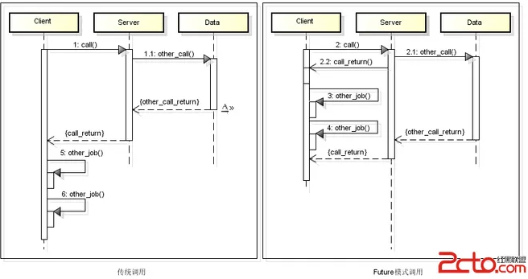

## 1. Future模式

### 1.1 Future模式核心思想

* Future模式的核心在于去除主函数的等待时间，并使得原本需要等待的时间段可以用于处理其他的业务逻辑。

* Future模式类似于商品订单。在网上购物，提交订单之后需要在家等待，并且可以做其他的事情。在程序设计中，当请求提交的时候，期望得到答案时，如果这个答复很慢，传统的是一直等待这个答复之后在去做别的事情，如果利用Future设计模式就无需等待答复的到来，在等待答复的过程中可以做其他的事情。

* 如下面的时序图所示：

  


### 1.2 代码：

* Client：

  ```java
  public class Client {

      public Data request(final String string) {
          final FutureData futureData = new FutureData();

          new Thread(new Runnable() {
              @Override
              public void run() {
                  //RealData的构建很慢，所以放在单独的线程中运行
                  RealData realData = new RealData(string);
                  futureData.setRealData(realData);
              }
          }).start();

          return futureData; //先直接返回FutureData
      }

  }
  ```

* Data：

  ```java
  public interface Data {

      String getResult() throws InterruptedException;

  }
  ```

* FutureData:

  ```java
  public class FutureData implements Data{

      private RealData realData;
      private boolean isReady = false;

      public RealData getRealData() {
          return realData;
      }

      public synchronized  void setRealData(RealData realData) {
          if (isReady){
              return;
          }
          this.realData = realData;
          isReady = true;
          notifyAll();
      }

      @Override
      public synchronized  String getResult() throws InterruptedException {
          if (!isReady){
              wait();
          }
          return realData.getResult();
      }
  }
  ```

* RealData:

  ```java
  public class RealData implements Data{
      private String data;

      public RealData(String data) {
          try {
              Thread.sleep(1000);
          } catch (InterruptedException e) {
              e.printStackTrace();
          }
          this.data = data;
      }

      @Override
      public String getResult() throws InterruptedException {
          return this.data;
      }
  }
  ```

* Main:

  ```java
  public class Main {

      public static void main(String[] args) throws InterruptedException {
          Client client = new Client();
          //这里会立即返回，因为获取的是FutureData，而非RealData
          Data data = client.request("name");
          //这里可以用一个sleep代替对其他业务逻辑的处理
          //在处理这些业务逻辑过程中，RealData也正在创建，从而充分了利用等待时间
         // Thread.sleep(2000);
          //使用真实数据
          System.out.println("数据="+data.getResult());
      }

  }
  ```

## 2. Master-Worker模式

### 2.1 概念

* Master-Worker模式是常用的并行计算模式。它的核心思想就是系统由两类进行协同工作：Master进程和Worker进程。Master负责接收和分配任务，Worker负责处理子任务。当各个Worker子进程处理完成之后，会将结果返回给Master，由Master做归纳和总结。
* 优点：
  * 将一个大的任务分解成为若干个小任务，并行执行，从而提高系统吞吐量。

### 2.2 代码

* Task

  ```java

  public class Task {

      private int id;
      private String name;
      private long price;

      public Task() {
      }

      public Task(int id, String name, long price) {
          this.id = id;
          this.name = name;
          this.price = price;
      }

      public int getId() {
          return id;
      }

      public void setId(int id) {
          this.id = id;
      }

      public String getName() {
          return name;
      }

      public void setName(String name) {
          this.name = name;
      }

      public long getPrice() {
          return price;
      }

      public void setPrice(long price) {
          this.price = price;
      }
  }
  ```

* Work

  ```java
  public class Work implements Runnable{
      
      private ConcurrentLinkedDeque<Task> workQueue;
      private  ConcurrentHashMap<String,Object> resultMap;

      @Override
      public void run() {
          while (true){
              Task input = this.workQueue.poll();
              if (input == null){
                  break;
              }
              //处理任务
              Object result = handle(input);
              this.resultMap.put(Integer.toString(input.getId()), result);
          }
      }

      private Object handle(Task task) {
          try {
              Thread.sleep(500);
          } catch (InterruptedException e) {
              e.printStackTrace();
          }
          return task.getPrice();
      }
    
     public void setWorkQueue(ConcurrentLinkedDeque<Task> workQueue) {
        this.workQueue = workQueue;
    }

    public void setResultMap(ConcurrentHashMap<String,Object> resultMap){
        this.resultMap = resultMap;
    }
  }
  ```

* Master


  }
  ```java
   /**
   * 用于分配任务
   * 收集结果集
   */
  public class Master {

     //1. 装配任务的集合
      private ConcurrentLinkedDeque<Task> workQueue = new ConcurrentLinkedDeque<Task>();
      //2. 装配work
      private HashMap<String , Thread> works = new HashMap<>();
      //3. 装配结果集
      private ConcurrentHashMap<String, Object> resultsMap = new ConcurrentHashMap<>();

      //4. 构造方法
      public Master(Work work, int countWork) {
          work.setWorkQueue(this.workQueue);
          work.setResultMap(this.resultsMap);
          for (int i=0; i<countWork; i++){
              this.works.put("子节点"+Integer.valueOf(i), new Thread(work));
          }
      }

      //5. 提交任务
      public void submmit(Task task){
           this.workQueue.add(task);
      }

      //6. 执行
      public void executeWork(){
           for(Map.Entry<String , Thread> me :this.works.entrySet()){
               me.getValue().start();
          }
      }

      public Object getResut(){
          long result = 0;
          for (Map.Entry<String, Object> me:resultsMap.entrySet()){
               result += (Long)me.getValue();
          }
          return result;
      }

      public boolean isComplete() {
          for (Map.Entry<String, Thread> me:works.entrySet()){
                if (me.getValue().getState() != Thread.State.TERMINATED){
                    return false;
                }
          }
          return true;
      }
  }
  ```

* Client

  ```java

  public class Client {  public static void main(String[] args){
        Work work = new Work();
        Master master = new Master(work, 10);
        Random random = new Random();
        for (int i=0;i<10;i++){
            Task task = new Task(i, "task"+i, random.nextLong());
            master.submmit(task);
        }

        master.executeWork();
        long startTime = System.currentTimeMillis();
        while (true){
            if(master.isComplete()){
                long runTime = System.currentTimeMillis()-startTime;
                Object ret = master.getResut();
                System.out.println("结果："+ret+"  运行时间： "+runTime);
                break;
            }
        }
    }
    }
  ```


 