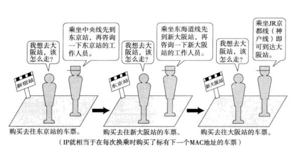
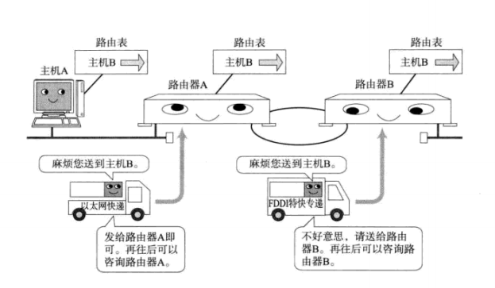
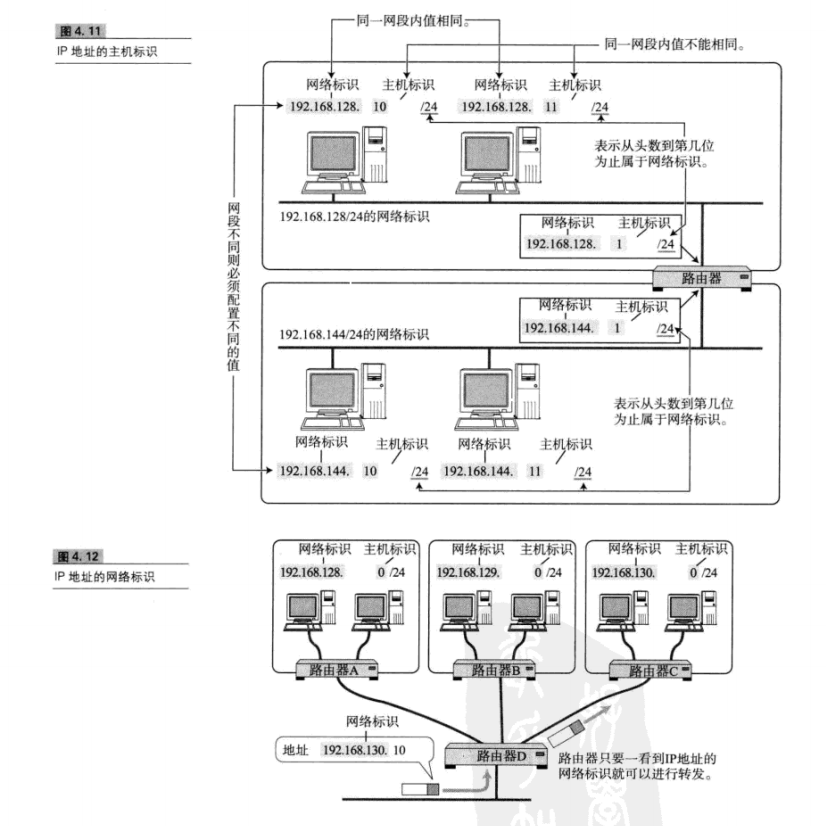
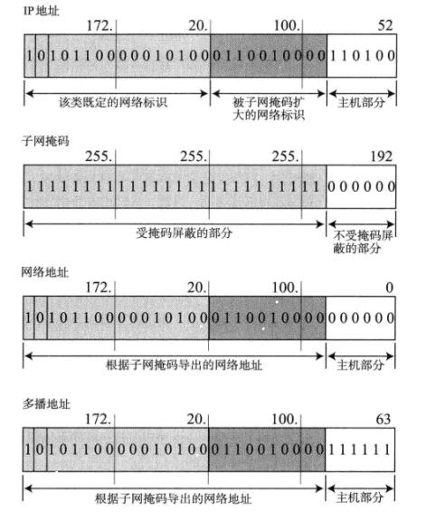

## 1. IP基础知识

* IP大致分为三大作用模块，他们是IP寻址、路由、以及分包和组包

### 1.1 IP地址属于网络层地址

* 在计算机通信中，为了识别通信对端，必须要有一个类似于地址的识别码进行标识。作为网络层的IP，也有这种地址信息。一般叫做IP地址。

### 1.2 路由控制

* 路由控制是指将分组数据发送到最终目标地址的功能。即使网络非常复杂，也可以通过路由控制确定到达目标地址的通路。

* 一个数据包之所以能够成功地达到目的地址，全靠路由控制。

* 一跳(Hop)：

  * Hop译为中文叫“跳”。它是指网络中的一个区间。IP包正是在网络中一个跳间被转发。因此IP路由也叫做多跳路由。在每一个区间内决定着包在下一跳被转发的路径。

  * 如图所示：

    

    

### 1.3  数据链路的抽象化

* ​ MTU的值在以太网中是1500字节，在FDDI中是4352字节，而ATM则为9180字节。IP的上一层可能会传输比这些MTU更多字节的数据，因此**必须在线路上传送比包长还要小的MTU**。
* 为了解决这个问题，IP进行分片处理(IP)，顾名思义，所谓分片处理是指，将较大的IP包分成多个较小的IP包。分片的包到了目标地址后会在被组合起来传给上一层。

### 1.3 IP属于面向无连接型

* IP面型无连接。即在发包之前，不需要建立与对端目标地址之间的连接。上层如果需要发送给IP的数据，该数据就会立即被压缩成IP包发送出去。
* **IP为什么要采用面向无连接方式？**
  * 为了简化和提速

### 1.4 IP地址基础知识

* IP地址(IPv4地址)由32为正整数表示

#### 1.4.1 IP地址由网路和主机两部分标识组成

* 如下图所示：

  

#### 1.4.2 IP地址的转换（子网掩码，网络地址）

