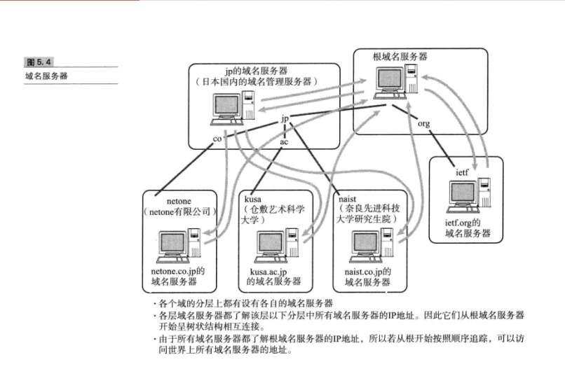
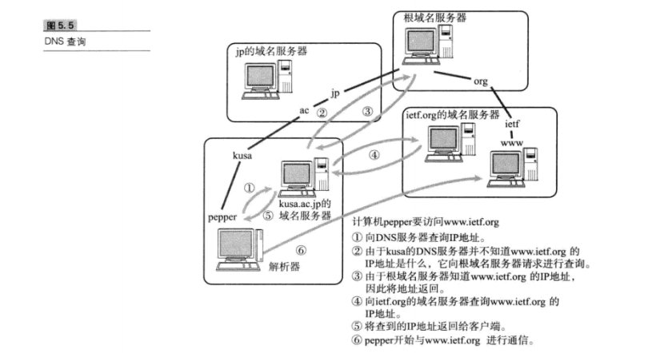

##  IP协议相关技术

### 1 DNS

* DNS叫做根域名服务器。它对DNS的检索起重要作用。

* 访问如图所示：

  

  

* 如果要新增或修改一个类似jp或者org的域名，在根域名服务器中进行追加或变更。

* **有了IP地址为什么还需要MAC地址？**

  1. 信息传递时候，需要知道的其实是两个地址：终点地址、下一跳的地址。IP地址本质上是终点地址，它在跳过路由器的时候不会改变，而MAC地址则是下一跳的地址，每跳过一次路由器都会改变。这就是为什么还要用MAC地址的原因之一，它起到了记录下一跳的信息的作用。 
  2. 网络体系结构的分层模型：用MAC地址和IP地址两个地址，用于分别表示物理地址和逻辑地址是有好处的。这样分层可以使网络层与数据链路层的协议更灵活地替换。 