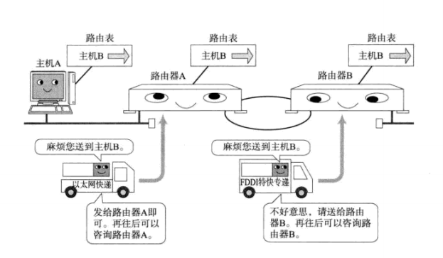

## 1. IP基础知识

* IP大致分为三大作用模块，他们是IP寻址、路由、以及分包和组包

### 1.1 IP地址属于网络层地址

* 在计算机通信中，为了识别通信对端，必须要有一个类似于地址的识别码进行标识。作为网络层的IP，也有这种地址信息。一般叫做IP地址。

### 1.2 路由控制

* 路由控制是指将分组数据发送到最终目标地址的功能。即使网络非常复杂，也可以通过路由控制确定到达目标地址的通路。

* 一个数据包之所以能够成功地达到目的地址，全靠路由控制。

* 一跳(Hop)：

  * Hop译为中文叫“跳”。它是指网络中的一个区间。IP包正是在网络中一个跳间被转发。因此IP路由也叫做多跳路由。在每一个区间内决定着包在下一跳被转发的路径。

  * 如图所示：

    

    

### 1.3  数据链路的抽象化

* ​