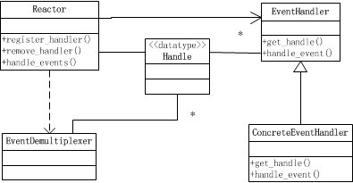
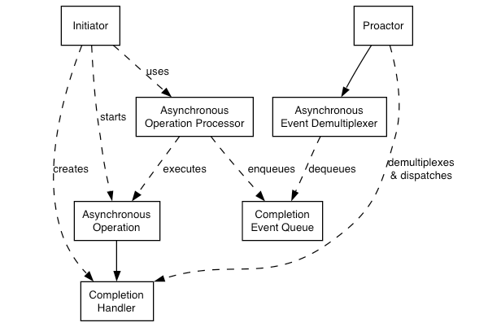

## 1. IO常用模型的介绍

### 1.1 常用的四种IO模型

* 同步阻塞IO(Blocking IO): 传统的IO模型
* 同步非阻塞IO(Non-blocking IO):默认创建的socket都是阻塞的，非阻塞IO要求socket被设置为NONBLOCK。
* IO多路复用(IO Multiplexing): 即经典的[Reactor](#Reactor模式与Proactor模式)设计模式，有时也称为异步阻塞IO，Java中的Selector和linux中的epoll都是这种模型。
* 异步IO(AIO: Asynchronous IO):即经典的Proactor设计模式，也称为异步非阻塞IO。
* 同步与异步的区别：
  * 同步与异步描述的是用户线程与内核的交互方式
    * 同步：同步是指用户线程发起IO请求后需要等待或者轮询内核IO操作完成后才能继续执行。
    * 异步：异步是指用户线程发起IO请求后仍继续执行，当内核IO操作完成后会通知用户线程。
* 阻塞与非阻塞的区别
  * 阻塞与非阻塞描述的是用户线程调用IO的方式
    * 阻塞是指IO操作需要彻底完成后才返回到用户空间
    * 非阻塞是指IO操作被调用后立即返回一份状态值，无需IO操作彻底完成。

### 1.2 同步阻塞IO

* 同步阻塞IO是最简单的IO模型，用户在内核中进行操作时候被阻塞，如下图琐事

  

### 1.3 同步非阻塞IO

* 同步非阻塞IO是在同步阻塞IO的基础上。将socket设置为NONBLOCK。这样用户在发起IO请求的时候可以立即返回。

  

### 1.4 异步阻塞IO

* IO多路复用模型是建立在内核提供的多路分离函数select基础之上的，使用select函数可以避免同步非阻塞IO模型中轮询等待的问题。

* 用户首先将需要进行IO操作的socket添加到select中，然会阻塞等待select系统调用返回，当数据到达时，socket被激活。select函数返回。用户线程正式发起read请求，读取数据并执行。

  

### 1.5 异步非阻塞IO

* 异步IO使用的是Proactor设计模式实现这一机制。

  

## 2. Reactor模式与Proactor模式

### 2.1 Reactor模式

* Reactor对应的类图如图所示，Reactor模式又叫反应器或反应堆，即实现注册描述以及事件的处理器。如图所示：

  

* Reactor模式的典型启动过程如下所示：

  1. 创建Rector
  2. 注册事件处理器
  3. 调用事件多路分发器进入无限事件循环
  4. 当操作系统通知描述符状态就绪的时候，事件多路分发器找出并调用此描述符注册的事件处理器。

* Reactor模式的优点：

  * 实现相对简单，相对于耗时短的处理高效
  * 操作系统可以在多个事件源上等待，并且避免了多线程编程相关的性能开销和编程的复杂性。
  * 事件的串行化对应用是透明的，可以顺序的同步执行不加锁
  * 事务分离，将与应用无关的多路分解和分配机制和与应用相关的回调函数分离开

* Reactor模式的缺点

  * Reactor处理耗时长的操作（如文件I/O）会造成事件分发的阻塞，影响到后续事件的处理。
  * 因此涉及到文件I/O相关的操作，需要使用异步I/O，即使用Proactor模式效果更佳。

### 2.2 Proactor模式

* Proactor模式又叫前摄器或主动器模式，如下图所示：

* 运行流程如下所示：
  1. Initiator主动调用Asynchronous Operation Processor发起异步I/O操作，
  2. 记录异步操作的参数和函数地址放入完成事件队列（Completion Event Queue）中
  3. Proactor循环检测异步事件是否完成。如果完成则从完成事件队列中取出回调函数完成回调。

