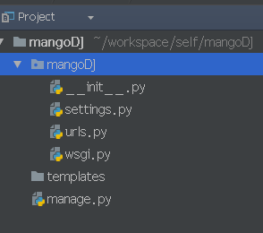

## django自定义用户、用户拦截的创建以及项目的搭建

> 项目地址：[mangoD](https://github.com/daiqiaobing/mangoDJ)

### 1. 创建虚拟环境

* 在创建虚拟环境之前先说下虚拟环境的作用：
  *  pyhton虚拟环境可以使python程序拥有独立的库和解释器，不和其他的程序共享，避免了不同python程序的相互的影响。


* 用户也可以直接在安装了python的环境中安装django框架

  ```shell
  pip install django
  ```

* 现在来说说怎样在centos中安装虚拟环境

  * 首先先安装virtualenv以及virtualenvwrapper模块，命令如下所示：

    ```shell
    sudo pip install virtualenv
    sudo pip install virtualenvwrapper
    ```

  * 然后再创建虚拟环境的目录并且配置环境变量

    ```shell
    mkdir /home/your/.virtualenv   # 其中.virtualenv可以是其他的名字只要与环境变量中的对应就可以了
    vi /home/your/.bashrc
    ```

    * 在.bashrc文件中添加一下语句

      ```shell
      export WORKON_HOME=/home/your/.virtualenvs
      export VIRTUALENVWRAPPER_SCRIPT=/usr/local/bin/virtualenvwrapper.sh
      source /usr/bin/virtualenvwrapper.sh
      ```

    * 保存并退出：wq

    * 运行  `source /home/your/.bashrc `

  * 此时virtualenvwrapper就可以使用了，常用命令：

    * 创建虚拟环境

      ```shell
      mkvirtualenv envname # 其中envname就是你需要创建的虚拟环境的名字
      ```

    * 切换环境：

      ```shell
      workon envname
      ```

    * 列出已有的环境：

      ```shell
      workon
      ```

    * 退出环境

      ```shell
      deactivate
      ```

    * 删除环境

      ```shell
      rmvirtualenv
      ```

* 安装好了虚拟环境之后我们需要创建一个虚拟环境`mkvirtualenv mango `，在`/home/your/.virtualenvs`我们可以看到一个文件夹`mango`，这个文件夹就是我们的虚拟环境的目录

* 然后我们需要切换到刚刚创建的`mango`环境中： `workon mango`

* 然后我们需要安装django，`pip install Django==1.11`

  * 在这个步骤我们可以将需要安装的包写在一个文件(requrement)中， 在文件中的包有：

    ```text
    Django==1.11
    MysqL-python==1.2.5
    ```

  * 然后通过命令`pip install -U -r requrement`就会自动将文件中的包安装好

* 接下来就需要我们创建自己的项目了

### 2. 创建项目

1. 打开pycharm（也可以是其他的IDE），点击file->New Project，此时会弹出一个创建项目的弹出框，在左边选择Django，在右边选择对应的目录（在选择的时候就创建一个文件夹作为项目路径和项目名称`mangoDJ`）， 然后选择对应的python环境，选择刚刚创建的`mango`的虚拟环境的目录

   * 对应的目录结构如下所示：

     

   * 创建apps文件夹，将apps文件夹设置为源文件夹（点击项目mangoDJ右键mark Directory as ->source Root），之后将所有创建的app都放在该文件夹下面，并且在settings.py中添加如下代码：

     ```python
     sys.path.insert(0,os.path.join(BASE_DIR,'apps'))
     ```

   * 将templates标记为`Template Folder`(点击项目mangoDJ右键mark Directory as ->Template Folder)

2.  配置启动环境：

   * 配置环境所需要的库文件：分别在setting和default setting中配置

   

   * 然后再右上角点击`edit configration`，添加`django serevr`，并且配置对应的端口号。

3. 创建app

   * 使用命令`python manager startapp account`创建`account`模块，并将account放在apps文件夹下面,并且在setting.py中的`INSTALLED_APPS`添加`account`(每创建一个app最好都放在apps文件夹下面)
   * 在使用命令`python manager startapp web`创建`web`模块，并将web放在apps文件夹下面,并且在setting.py中的`INSTALLED_APPS`添加`web`
   * 在使用命令`python manager startapp common`创建`common`模块，并将common放在apps文件夹下面,并且在setting.py中的`INSTALLED_APPS`添加`common`

4. 在项目mangoDJ下创建static文件夹用于存放静态资源

   * 在setting.py中配置如下信息：

     ```python
     # URL to use when referring to static files located in STATIC_ROOT.
     STATIC_URL = '/static/'

     # Additional locations the staticfiles app will traverse if the
     # FileSystemFinder finder is enabled.
     STATICFILES_DIRS = (
         BASE_DIR / 'static',
     )
     ```

   * 配置这些信息可以访问到静态资源

### 3. 配置文件编辑

1. 配置setting.py文件，主要配置数据库， 缓存等信息

2. 数据库配置的格式：

   ```python
   DATABASES = {
       'default': {
           'ENGINE': 'django.db.backends.mysql',  
           'NAME': 'mango',  # Or path to database file if using sqlite3.
           'USER': 'root',
           'PASSWORD': 'root',
           'HOST': '127.0.0.1',  
           'PORT': '3306',  # Set to empty string for default.
       },
   }
   ```

3. 配置缓存(根据自己的情况可要可不要)

   ```python
   CACHES = {
       "default": {
           "BACKEND": "django_redis.cache.RedisCache",
           "LOCATION": "redis://172.0.0.1:6379/1",
           "OPTIONS": {
               "CLIENT_CLASS": "django_redis.client.DefaultClient",
           }
       }
   }
   ```

### 4. 用户请求拦截

* 在配置用户请求拦截的时候需要在配置文件中配置对应的 `LOGIN_URL = '/user/login'`, `LOGOUT_URL = '/logout'` 

* 在common模块中创建require.py,并且添加如下代码（[也可以参考这篇文章](http://blog.csdn.net/qq_21178933/article/details/78531733)）：

  ```python
  # -*- coding: utf-8 -*-


  def required(wrapping_functions, patterns_rslt):
      if not hasattr(wrapping_functions, '__iter__'):
          wrapping_functions = (wrapping_functions,)

      return [
          _wrap_instance__resolve(wrapping_functions, instance)
          for instance in patterns_rslt
      ]


  def _wrap_instance__resolve(wrapping_functions, instance):
      if not hasattr(instance, 'resolve'):
          return instance
      resolve = getattr(instance, 'resolve')

      def _wrap_func_in_returned_resolver_match(*args, **kwargs):
          rslt = resolve(*args, **kwargs)

          if not hasattr(rslt, 'func'):
              return rslt
          f = getattr(rslt, 'func')

          for _f in reversed(wrapping_functions):
              # @decorate the function from inner to outter
              f = _f(f)

          setattr(rslt, 'func', f)

          return rslt

      setattr(instance, 'resolve', _wrap_func_in_returned_resolver_match)

      return instance

  ```

  ​

* 在urls.py中添加如下配置（一定要写在登陆url之前）：

  ```python
  urlpatterns += required(
      partial(login_required, login_url='user_login'),
      urlpatterns
  )

  urlpatterns += [
      url(r'user/login', web.view_home.login, name='user_login'),
  ]
  ```

  ​

### 5. 用户自定义编写

1. 在`account`模块中models.py编写自定义用户实体，需要在setting.py中配置实体类代码如下所示

   ```python
   AUTH_USER_MODEL = 'account.Account'
   ```

2. 编写实体：

   ```python
   # -*- coding: utf-8 -*-
   from __future__ import unicode_literals

   from django.contrib.auth.base_user import BaseUserManager, AbstractBaseUser
   from django.contrib.auth.models import PermissionsMixin
   from django.db import models


   class AccountManager(BaseUserManager):
       def _create_user(self, username, password, is_staff, is_active, **extra_fields):
           if username:
               raise ValueError("the input username is error")
           if password:
               raise ValueError("the input password is error")
           user = self.model(username=username, password=password, is_staff=is_staff, is_active=False, **extra_fields)
           user.save(self._db)
           return user

       def create_user(self, username, password, **extra_fields):
           return self._create_user(self, username=username, password=password, is_staff=False, is_active=False,
                                    **extra_fields)

       def create_superuser(self, username, password, **extra_fields):
           return self._create_user(self, username=username, password=password, is_staff=True, is_active=True,
                                    **extra_fields)


   class AbstractUser(AbstractBaseUser, PermissionsMixin):
       # 用户名称
       username = models.CharField(unique=True, max_length=30)
       is_staff = models.BooleanField(_('staff status'), default=False)
       is_active = models.BooleanField(_('active'), default=True)
       USERNAME_FIELD = 'username'
       REQUIRED_FIELDS = []
       objects = AccountManager()

       class Meta(object):
           db_table = 'account'
           abstract = True

       def get_short_name(self):
           return self.get_username()

       def get_full_name(self):
           return self.get_username()


   class Account(AbstractUser):
       nick_name = models.CharField(max_length=30, default='')
       login_date = models.DateTimeField(auto_now_add=True, editable=False, blank=True)

       class Meta(AbstractUser.Meta):
           permissions = (
               ('person:info', '我的面板:个人信息'),
               ('person:modify-pwd', '我的面板:修改密码'),
               ('user:list', '平台用户管理:用户帐号管理'),
               ('user:score-manage', '用户管理:积分账户管理'),
           )

           swappable = 'AUTH_USER_MODEL'
   ```

   ​

3.  自定义用户认证，在setting配置对应的认证的类，如下：

   ```python
   # -*- coding: utf-8 -*-
   from django.contrib.auth.backends import ModelBackend
   from django.db.models import Q
   from account.models import Account


   class AccountBackend(ModelBackend):
       
       def authenticate(self, username=None, password=None, **kwargs):
           try:
               user = Account.objects.get(Q(username=username))
               if user.password == password:
                   return user
           except Account.DoesNotExist:
               return None
           return None
   ```

### 对应的项目地址为：[mangoDJ](https://github.com/daiqiaobing/mangoDJ)